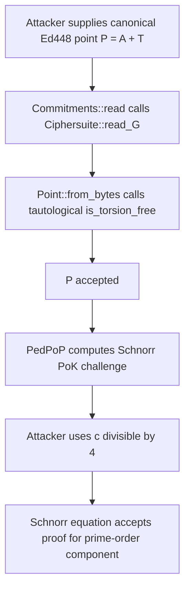

### Title
Ed448 torsion-point acceptance enables forged Schnorr proofs-of-knowledge - ([File: crypto/ed448/src/point.rs])

### Summary
`Ed448` point decoding intends to reject non-prime-order points, but `Point::is_torsion_free` computes `(-P) + P`, which is always the identity for every valid curve point. Consequently, `Ciphersuite::read_G` accepts canonical encodings of torsion components. A PedPoP participant can encode a commitment `A + T`, where `T` has order four, and forge a Schnorr proof of knowledge for the prime-order component whenever the challenge is divisible by four. This is a concrete proof forgery reachable through `Commitments::read` and `SchnorrSignature::read`.

### Finding Description
`GroupEncoding::from_bytes` for `Ed448` attempts to enforce subgroup membership with `point.is_torsion_free()`, but that predicate is tautological: it multiplies the point by `-1` and adds the original point, yielding identity unconditionally. `Ciphersuite::read_G` then accepts the encoding because decompression succeeded and re-encoding is canonical; it does not perform an independent subgroup check. [1](#0-0) [2](#0-1) 

PedPoP accepts these points in `Commitments::read`, caches the commitment bytes, and verifies a Schnorr proof against `msg.commitments[0]` using the context-, participant-, nonce-, and commitment-bound challenge. [3](#0-2) [4](#0-3) 

Schnorr verification evaluates `R + cA - sG == 0` directly, without clearing a cofactor. [5](#0-4) 

### Impact Explanation
An attacker can prove “knowledge” of a public commitment outside the intended prime-order subgroup without knowing a scalar whose generator multiplication equals it. On Ed448, where the full curve has cofactor four, choose an order-four point `T`, a known prime-order commitment `A = aG`, and submit `P = A + T`. If the Fiat-Shamir challenge satisfies `c mod 4 = 0`, the torsion component disappears during verification:

`R + cP - sG = R + cA + cT - sG = identity`

because `cT = identity`. The attacker can grind `R` or another challenge-bound input until `c` is divisible by four, expected after a small number of attempts, then compute `s = r + ca`.

This bypasses the proof-of-knowledge invariant for PedPoP round-one commitments. The subsequent share check will generally expose the torsion component, so the demonstrated impact is primarily acceptance of a malformed commitment and protocol abort rather than silent completion, but it remains a forged cryptographic proof accepted by production verification code.

### Likelihood Explanation
An unprivileged DKG participant controls its own `EncryptionKeyMessage<Commitments>` bytes and can select `T`, `A`, and grind `R`. No malformed encoding is needed: the forged commitment is a canonical Ed448 encoding, so framing or parsing restrictions do not prevent it. Success depends only on obtaining a challenge congruent to zero modulo the order of `T`; for an order-four torsion point this occurs with probability about `1/4`.

### Recommendation
Implement a real subgroup-membership check for Ed448, such as multiplying the decoded point by the prime subgroup order and requiring identity, or multiplying by the cofactor and verifying the result is not identity while validating the intended prime-order subgroup according to the protocol’s requirements. The check should run inside `GroupEncoding::from_bytes` or another mandatory point-validation path used by `Ciphersuite::read_G`.

The tautological implementation must not remain:

```rust
((*self * (Scalar::ZERO - Scalar::ONE)) + self).is_identity()
```

Add tests that enumerate all low-order Ed448 points and confirm `Ciphersuite::read_G`, `Commitments::read`, and `SchnorrSignature::read` reject them where prime-order points are required. Also add a regression test for a `P = aG + T` commitment with a challenge satisfying `c mod 4 = 0`.

### Proof of Concept
Conceptually:

```rust
// Let G be the Ed448 prime-order generator and T an order-four torsion point.
let a = random_scalar();
let A = G * a;
let malicious_commitment = A + T; // Outside the prime-order subgroup.

// Encode malicious_commitment canonically as commitments[0].
// Iterate over R = rG until the PedPoP challenge c satisfies c mod 4 == 0.
let s = r + c * a;
let forged_signature = SchnorrSignature { R: G * r, s };
```

Verification computes:

```text
R + c(A + T) - sG
= rG + caG + cT - (r + ca)G
= cT
= identity        when c mod 4 == 0
```

The acceptance path is therefore:



### Citations

**File:** crypto/ed448/src/point.rs (L294-318)
```rust
impl Point {
  fn is_torsion_free(&self) -> Choice {
    ((*self * (Scalar::ZERO - Scalar::ONE)) + self).is_identity()
  }
}

impl GroupEncoding for Point {
  type Repr = <FieldElement as PrimeField>::Repr;

  fn from_bytes(bytes: &Self::Repr) -> CtOption<Self> {
    // Extract and clear the sign bit
    let sign = Choice::from(bytes[56] >> 7);
    let mut bytes = *bytes;
    let mut_ref: &mut [u8] = bytes.as_mut();
    mut_ref[56] &= !(1 << 7);

    // Parse y, recover x
    FieldElement::from_repr(bytes).and_then(|y| {
      recover_x(y).and_then(|mut x| {
        x.conditional_negate(x.is_odd().ct_eq(&!sign));
        let not_negative_zero = !(x.is_zero() & sign);
        let point = Point { x, y, z: FieldElement::ONE };
        CtOption::new(point, not_negative_zero & point.is_torsion_free())
      })
    })
```

**File:** crypto/ciphersuite/src/lib.rs (L91-100)
```rust
  fn read_G<R: Read>(reader: &mut R) -> io::Result<Self::G> {
    let mut encoding = <Self::G as GroupEncoding>::Repr::default();
    reader.read_exact(encoding.as_mut())?;

    let point = Option::<Self::G>::from(Self::G::from_bytes(&encoding))
      .ok_or_else(|| io::Error::other("invalid point"))?;
    if point.to_bytes().as_ref() != encoding.as_ref() {
      Err(io::Error::other("non-canonical point"))?;
    }
    Ok(point)
```

**File:** crypto/dkg/pedpop/src/lib.rs (L109-128)
```rust
impl<C: Ciphersuite> ReadWrite for Commitments<C> {
  fn read<R: Read>(reader: &mut R, params: ThresholdParams) -> io::Result<Self> {
    let mut commitments = Vec::with_capacity(params.t().into());
    let mut cached_msg = vec![];

    #[allow(non_snake_case)]
    let mut read_G = || -> io::Result<C::G> {
      let mut buf = <C::G as GroupEncoding>::Repr::default();
      reader.read_exact(buf.as_mut())?;
      let point = C::read_G(&mut buf.as_ref())?;
      cached_msg.extend(buf.as_ref());
      Ok(point)
    };

    for _ in 0 .. params.t() {
      commitments.push(read_G()?);
    }

    Ok(Commitments { commitments, cached_msg, sig: SchnorrSignature::read(reader)? })
  }
```

**File:** crypto/dkg/pedpop/src/lib.rs (L321-334)
```rust
      // Step 5: Validate each proof of knowledge
      // This is solely the prep step for the latter batch verification
      msg.sig.batch_verify(
        rng,
        &mut batch,
        l,
        msg.commitments[0],
        challenge::<C>(self.context, l, msg.sig.R.to_bytes().as_ref(), &msg.cached_msg),
      );

      commitments.insert(l, msg.commitments.drain(..).collect::<Vec<_>>());
    }

    batch.verify_vartime_with_vartime_blame().map_err(PedPoPError::InvalidCommitments)?;
```

**File:** crypto/schnorr/src/lib.rs (L86-110)
```rust
  /// Return the series of pairs whose products sum to zero for a valid signature.
  /// This is intended to be used with a multiexp.
  pub fn batch_statements(&self, public_key: C::G, challenge: C::F) -> [(C::F, C::G); 3] {
    // s = r + ca
    // sG == R + cA
    // R + cA - sG == 0
    [
      // R
      (C::F::ONE, self.R),
      // cA
      (challenge, public_key),
      // -sG
      (-self.s, C::generator()),
    ]
  }

  /// Verify a Schnorr signature for the given key with the specified challenge.
  ///
  /// This challenge must be properly crafted, which means being binding to the public key, nonce,
  /// and any message. Failure to do so will let a malicious adversary to forge signatures for
  /// different keys/messages.
  #[must_use]
  pub fn verify(&self, public_key: C::G, challenge: C::F) -> bool {
    multiexp_vartime(&self.batch_statements(public_key, challenge)).is_identity().into()
  }
```
